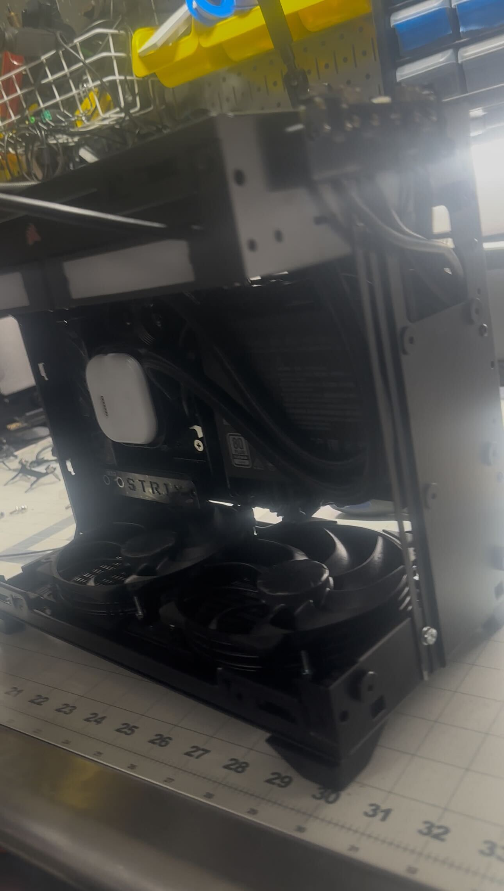

# Host Hardware

I'm an experienced PC modder/OCer and like to rebuild my work PC every 3-5 years. My last build was the [fastest 3960X in the world](https://www.reddit.com/r/overclocking/comments/o1bg82/3960x_19745_tse/) at [19,745 TSE](https://www.3dmark.com/spy/20886143). Both 3090s were shunted, delidded, and EVC2-modded. The goal for this build was **portability and ML performance** but seeing the 5090 clock in at 25,506 Graphics Score on TSE was extremely disappointing since my twin 3090s scored 23,012 five years ago.

So I delidded the GPU, replaced thermals, shunted the VRMs, rebuilt the power delivery circuitry to safely draw up to 850W (the 12VHPWR connector is a travesty), and flashed a 1000W BIOS ...again ¯\\_(ツ)_/¯. A few CNC modifications were made to the case so it could maintain proper temps during the 8-hour stability test ran at 78f ambient - you can find pictures of that at the bottom.

# Parts

- CPU: AMD Ryzen 9 9950X3D
- Mobo: ASUS ROG STRIX X870-I
- GPU: Gigabyte 5090 Gaming OC
- SSD: WD_Black SN8100 4TB
- RAM: F5-6000J3036F48GX2-FX5
- PSU: CM V1100 SFX Platinum
- Case: Cooler Master NR200P V3
- Cooler: CORSAIR Titan 280 RX
- Riser: LINKUP PCIE 5.0 Riser Cable
- Fans: Noctua NF-A14x25r G2 PWM

# OS

1. Install Windows 11 Pro
2. Run Activation https://github.com/massgravel/Microsoft-Activation-Scripts
```powershell
# PowerShell Admin
irm https://get.activated.win | iex
```
3. Run Remove AI https://github.com/zoicware/RemoveWindowsAI
```powershell
# PowerShell Admin
& ([scriptblock]::Create((irm "https://raw.githubusercontent.com/zoicware/RemoveWindowsAI/main/RemoveWindowsAi.ps1")))
```
4. Run Debloat https://github.com/Raphire/Win11Debloat
```powershell
# PowerShell Admin
& ([scriptblock]::Create((irm "https://debloat.raphi.re/")))
```
5. Install common VCC redist ([Download](https://download.visualstudio.microsoft.com/download/pr/40b59c73-1480-4caf-ab5b-4886f176bf71/D62841375B90782B1829483AC75695CCEF680A8F13E7DE569B992EF33C6CD14A/VC_redist.x64.exe))
6. Install latest AMD drivers ([Link](https://www.amd.com/en/support/downloads/drivers.html/chipsets/am5/x870.html))
7. Install clean NVidia drivers ([Link](https://www.techpowerup.com/download/techpowerup-nvcleanstall/))
8. OC Hardware. TSE [22,478](https://www.3dmark.com/3dm/148846209) -> [24,106](https://www.3dmark.com/3dm/149208021)

# Pics

Or it didn't happen, of course. The GPU is secured to the case with screws in 3 additional places to keep it safe during air and ground transport.


