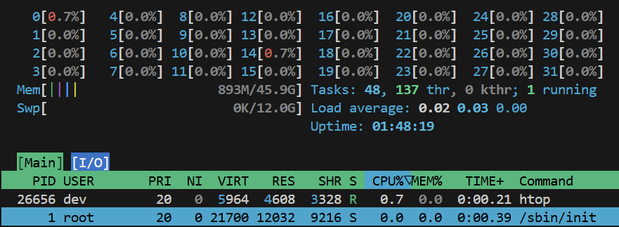

# Windows Subsystem for Linux (WSL)

We're setting up a linux-based environment for this guide because most modern cloud deployment targets are ARM or linux-based x64. WSL uses GPU Paravirtualization (GPU-PV) whereas your production B200 and/or GVL72 nodes use PCIe passthrough (DDA) via the cloud providers' hardware scheduler like AWS Nitro or GCP Borg. GPU-PV incurs a relative performance penalty but, for the purposes of our guide, it is negligible.

# Host Setup
1. Enable WSL on Windows
```powershell
# PowerShell Admin
wsl --install
# Restart your PC and set up a default username ("dev" recommended).
```
2. Install Ubuntu LTS ("Long Term Support" - use this in prod unless building from [Alpine](https://www.alpinelinux.org/)).
```powershell
# PowerShell Admin
wsl --install -d Ubuntu-24.04 --name Yevai --web-download
```
3. Download and install VSC (Visual Studio Code - [Link](https://code.visualstudio.com/))
4. Use [this knowledge](https://code.visualstudio.com/docs/remote/wsl) to connect to WSL with VSC.

Everything else in this guide, unless otherwise explicitly indicated, will be done in WSL.

# WSL Setup

Assume all commands to be ran, unless otherwise explicitly indicated, in $HOME (~) of the active WSL user. You will see "$HOME" used instead of ~. This is best practice for many reasons we'll skip in this guide. For example, in some target environments like AWS Lambda, you will need to override $HOME to enable libraries to use the /tmp/ ephemeral FS layer cache. $HOME and ~/ do not always interact the way one would expect.

1. Update OS components and compensate for the fact that we are in WSL
```bash
sudo apt update
sudo apt upgrade

# Install WSL utilities
sudo apt install wslu
```
2. I have mixed feelings about Homebrew but it makes this guide much easier so let's use it.
```bash
# Install Homebrew
/bin/bash -c "$(curl -fsSL https://raw.githubusercontent.com/Homebrew/install/HEAD/install.sh)"

# Activate it in the current shell
eval "$(/home/linuxbrew/.linuxbrew/bin/brew shellenv)"

# Install the Github CLI, ZSH, PL10K, and JQ. Several LM-based coding tools benefit from PL10K!
brew install gh zsh powerlevel10k jq
```
3. Shell setup - feel free to skip if you have your own preferences. The guide will rely on this.
```bash
# Allow ZSH and set it as default
command -v zsh | sudo tee -a /etc/shells
chsh -s $(which zsh)

# Install OhMyZSH
sh -c "$(wget https://raw.githubusercontent.com/ohmyzsh/ohmyzsh/master/tools/install.sh -O -)"

# Install and go to ~/Git. $_ gets the argument of the previous command.
mkdir "$HOME/Git" && cd $_

# Log into GitHub ("open" works thanks to wslu). Don't use tokens unless you have no choice.
gh auth login

# Set the global git config - doing so from the active GH CLI is best practice.
# Note: this is especially useful when automating in CI with service accounts.
git config --global user.name "$(gh api user --jq '.name')"
git config --global user.email "$(gh api user/emails --jq '.[] | select(.primary) | .email')"

# Confirm your git username and email
echo "$(git config --global --list)" | grep user

# Clone dis and go to it.
gh repo clone https://github.com/yev-ai/personal-yev-substack && cd personal-yev-substack

# Git aliases are useful, especially for rebases / merges / automation.
git config --global alias.root "rev-parse --show-toplevel"

# This now shows the folder of the git repository you're in.
git root

# Mount ZSH and PL10K configs - this also serves to confirm our paths.
chmod +x "$(git root)/files/001_wsl_setup/setup.sh"
"$(git root)/files/001_wsl_setup/setup.sh"

# Export the Git Root directory into our pre-zsh hook. This is where you checked out the repo.
echo "export GIT_ROOT=\"$(dirname "$(git root)")\"" >> ~/.zshrc-pre.sh

# Source the new ZSHRC
source ~/.zshrc

# Make sure our GIT_ROOT is set correctly - we'll use this heavily in later sections:
echo "$GIT_ROOT"
```

# Confirm GPU Virtualization
If your host and WSL are set up correctly, including the latest drivers, this should be available in WSL:
```bash
nvidia-smi
```

You should see output similar to:

```bash
Tue Jan  6 11:22:22 2026       
+-----------------------------------------------------------------------------------------+
| NVIDIA-SMI 590.48.01              Driver Version: 591.59         CUDA Version: 13.1     |
+-----------------------------------------+------------------------+----------------------+
| GPU  Name                 Persistence-M | Bus-Id          Disp.A | Volatile Uncorr. ECC |
| Fan  Temp   Perf          Pwr:Usage/Cap |           Memory-Usage | GPU-Util  Compute M. |
|                                         |                        |               MIG M. |
|=========================================+========================+======================|
|   0  NVIDIA GeForce RTX 5090        On  |   00000000:01:00.0  On |                  N/A |
|  0%   40C    P0             75W /  600W |    2187MiB /  32607MiB |      0%      Default |
|                                         |                        |                  N/A |
+-----------------------------------------+------------------------+----------------------+

+-----------------------------------------------------------------------------------------+
| Processes:                                                                              |
|  GPU   GI   CI              PID   Type   Process name                        GPU Memory |
|        ID   ID                                                               Usage      |
|=========================================================================================|
|  No running processes found                                                             |
+-----------------------------------------------------------------------------------------+
```

The windows host OS reserves around ~2GB VRAM. This guide will gracefully work around lack of exclusive GPU control which we normally have in cloud nodes.

# Confirm Memory Allocation

```bash
# Install a basic resource monitor for WSL
brew install htop

# Run it
htop
```

You should see output similar to this:



Only about 50% of our 96GB RAM is available to WSL under "Mem" along with a 12GB swap file. This will become important later.