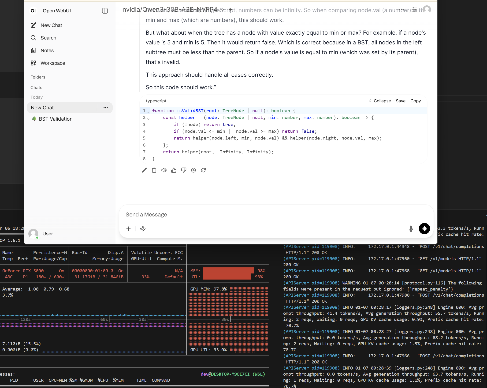

Chapter 3 of our "development from scratch" guide. See See [Chapter 2](./001_wsl_setup.md.md) for pre-requisities.

# Table of Contents

For this, we'll run a 30B Qwen3 model at 60-90TPS (we'll optimize this later) with a focus on coding assistance.

1. WSL Docker Setup
2. Download A 30B Model
3. Run it with vLLM *(Some optimizations included to make it palatable)*
4. Chat with Model *(The UI is preloaded with model-specific settings)*

# 1. WSL Docker Setup

We should **install Docker Engine inside WSL** so that `nvidia-container-toolkit` can interface directly with the WSL Linux kernel via [dxgkrnl](https://learn.microsoft.com/en-us/windows-hardware/drivers/display/directx-graphics-kernel-subsystem). This lets WSL  sub in for a native host OS by directly managing the GPU resources.

```bash
# Install Docker
curl -fsSL https://get.docker.com | sh

# Add user to group
sudo usermod -aG docker $USER && newgrp docker

# Reload
newgrp docker

# Confirm socket (should show CONTAINER ID in red)
docker ps | grep "CONTAINER ID"

# Add Nvidia repositories
curl -fsSL https://nvidia.github.io/libnvidia-container/gpgkey | sudo gpg --dearmor -o /usr/share/keyrings/nvidia-container-toolkit-keyring.gpg \
  && curl -s -L https://nvidia.github.io/libnvidia-container/stable/deb/nvidia-container-toolkit.list | \
    sed 's#deb https://#deb [signed-by=/usr/share/keyrings/nvidia-container-toolkit-keyring.gpg] https://#g' | \
    sudo tee /etc/apt/sources.list.d/nvidia-container-toolkit.list

# Update sources and install
sudo apt-get update
sudo apt-get install -y nvidia-container-toolkit

# Configure NVidia runtime
sudo nvidia-ctk runtime configure --runtime=docker

# Restart docker
sudo systemctl restart docker
```

# 2. Download A 30B Model

The casual favorite. Make an account on [HuggingFace](https://huggingface.co/) and [get an access token here](https://huggingface.co/settings/tokens).

```bash
# Install the HuggingFace CLI
brew install huggingface-cli

# Enable Git credential store
git config --global credential.helper store

# Log In (also store as git credential)
hf auth login

# Confirm you're logged in
hf auth whoami

# Create a folder for HuggingFace models
mkdir "$HOME/HF_Models"

# Add it to the pre-zshrc hook from Chapter 2
echo 'export HF_HOME="$HOME/HF_Models"' >> "$HOME/.zshrc-pre.sh" && source "$HOME/.zshrc"

# Confirm it's available. Your models will download here.
echo $HF_HOME
```

[Qwen3-30B-A3B-NVFP4](https://huggingface.co/nvidia/Qwen3-30B-A3B-NVFP4) is a solid Blackwell "Hello World" model. While it's *technically* a 30B model, it uses only ~3.3B active parameters per token, giving it decent throughput on a 5090. It's not particularly great (even compared to other single-GPU 5090 options) at anything, but it is one of the rare cases where **[NVFP4 quantization resulted in higher scores](https://huggingface.co/nvidia/Qwen3-30B-A3B-NVFP4)** on some of the benchmarks we care about.

```bash
hf download nvidia/Qwen3-30B-A3B-NVFP4
```

# 3. Run it with vLLM

Blackwell GPUs support [NVFP4](https://developer.nvidia.com/blog/introducing-nvfp4-for-efficient-and-accurate-low-precision-inference/) (1 sign, 2 exponent, and 1 mantissa bit) models and we're going to be heavily abusing this. This groups weights into blocks of 16, each of which shares a high-precision 8-bit (E4M3) scale factor and allows the 4-bit quantized coefficients to handle the finer details.

They also come with the [2nd Gen Transformer Engine](https://github.com/NVIDIA/TransformerEngine), which which has Tensor Core instructions that operate directly on the compressed 4-bit blocks. The result of this is much more efficient use of VRAM that lets us run much larger models with only ~28GB of available VRAM (4GB for host OS).

[vLLM](https://github.com/vllm-project/vllm) recently added experimental support for NVFP4 so we don't have to build [TensorRT-LLM](https://github.com/NVIDIA/TensorRT-LLM) from source and [compile our models for TRT-LLM](https://github.com/NVIDIA/Model-Optimizer) to get reasonable [TTFT (time to first token) and TPS (tokens per second)](https://docs.nvidia.com/nim/benchmarking/llm/latest/metrics.html). vLLM also comes with a number of optimizations like [PagedAttention](https://arxiv.org/abs/2309.06180) for the [KV cache](https://huggingface.co/blog/not-lain/kv-caching).

```bash
# Build the vLLM container.
chmod +x "$(git root)/docs/002_inference/build.sh"
"$(git root)/docs/002_inference/build.sh"

# Start the vLLM container. This takes A WHILE (8-10 minutes) for the precompute. Please be patient.
chmod +x "$(git root)/docs/002_inference/run-model.sh"
"$(git root)/docs/002_inference/run-model.sh"
```

# 4. Chat with Model

```bash
# Start the UI server.
chmod +x "$(git root)/docs/002_inference/run-ui.sh"
"$(git root)/docs/002_inference/run-ui.sh"
```

Head over to http://localhost:1338

First, you'll have to "warm up" vLLM with a simple hello world prompt. This will take a while, after which you can expect 60-90TPS. We'll optimize this later. When you first open localhost in your browser, you may see a few errors. Click on "Check again" and/or reload the page!




# Bonus: Resource Monitoring

```bash
# Install pipx
sudo apt install -y pipx

# Install nvitop
pipx install nvitop

# Add to path
echo 'export PATH="$HOME/.local/bin:$PATH"' >> "$HOME/.zshrc-pre.sh" && source "$HOME/.zshrc"

# Run nvitop
nvitop
```